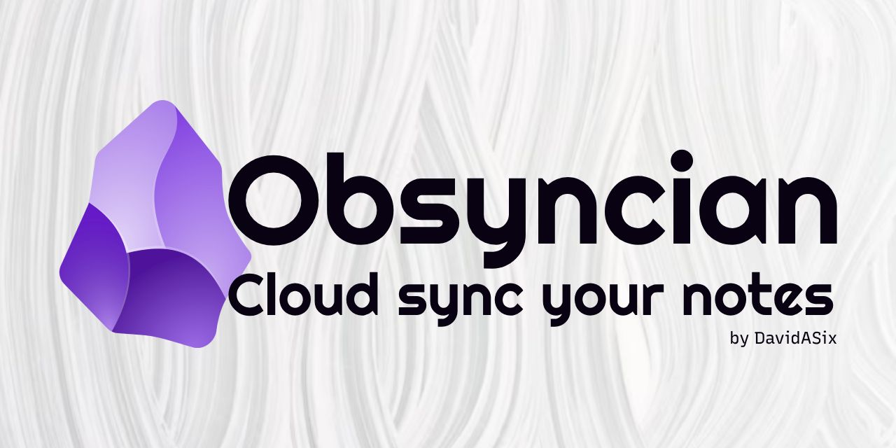

# Obsyncian | Sync your Obsidian notes from Linux to Google Drive
Sync your notes to the cloud with the CRON job, and create backups locally to never lose a thought! 💭

This script uses rclone, zenity, and cron to back your notes up to the cloud, and to a local zipped file.

## Overview


## Usage
To utilize this project, clone the repository to a script or Application folder.

### Install
```
cd obsyncian
sudo chmod +x ./install.sh ./obsidian-sync.sh ./uninstall.sh
./install.sh
```
Read and follow the instructions in the Zenity setup wizard.
And you're done!

### Uninstall
```
cd obsyncian
./uninstall.sh
```

## Notes
This script uses bi-directional syncing, so you can set it up on multiple devices to have access to your notes everywhere. In this type of setup, the Google Drive or cloud services is your "source of truth".

## Sync to Android
You can sync your notes to Android by using an app like DriveSync (unaffiliated to this project).
[You can download it here](https://play.google.com/store/apps/details?id=com.ttxapps.drivesync&hl=en&gl=US&pli=1)
[](https://play.google.com/store/apps/details?id=com.ttxapps.drivesync&hl=en&gl=US&pli=1)

## Like my work? 
[](https://ko-fi.com/davidasix)